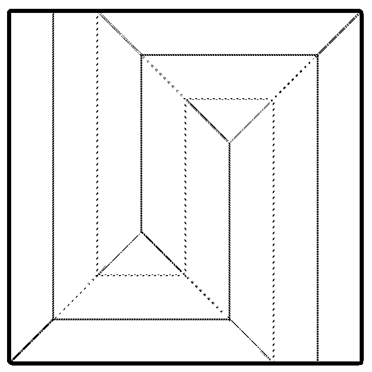

# Origami Laser Etching
Convert origami crease pattern folding image into an image that can be used for laser etching to pre-etch an origami paper before performing the folds.

From a colored crease pattern image to a black and white image ready for etching:
 

